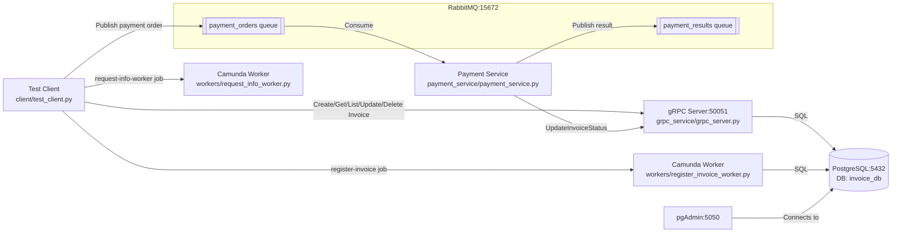

# Rechnungsbearbeitung (gRPC + RabbitMQ + Docker)

Moderne, verteilte Architektur für Rechnungsverarbeitung und asynchrone Zahlungsbearbeitung.

## Architektur-Überblick



---

## Hauptkomponenten

### gRPC Server (`grpc_service/grpc_server.py`)

**Zweck:** gRPC Endpunkte für CRUD-Operationen auf Rechnungen.

**Methoden:**

| Methode | Input | Output | Beschreibung |
| ------- | ----- | ------ | ------------ |
| `CreateInvoice` | id, supplier, amount | Invoice | Neue Rechnung erstellen. Validiert, dass ID nicht doppelt existiert. |
| `GetInvoice` | id | Invoice | Einzelne Rechnung abrufen. |
| `ListInvoices` | skip, limit | [Invoice], total | Alle Rechnungen mit Pagination. |
| `UpdateInvoice` | id, supplier?, amount? | Invoice | Supplier/Amount aktualisieren (optional). |
| `UpdateInvoiceStatus` | id, status | Invoice | Nur den Status einer Rechnung aktualisieren. |
| `DeleteInvoice` | id | success | Rechnung löschen. |

**Workflow beispiel:**

```text
Client ruft CreateInvoice auf
       ↓
gRPC Server prüft: Existiert diese ID schon?
       ↓
Falls nein: db_helpers.create_invoice() → SQLAlchemy INSERT
       ↓
StructuredLogger tracked: "DB CREATE invoice [SUCCESS] - invoice_id=INV-001"
       ↓
Protobuf Message → Client
```

---

## Invoice-Datenobjekt

Die fachliche Rechnung wird im Projekt an drei Stellen abgebildet:

- als SQLAlchemy-Model in `grpc_service/models/invoice.py`
- als gRPC-Message `Invoice` in `grpc_service/proto/invoice.proto`
- als Python-Objekt aus den generierten Stubs in `grpc_service/generated/invoice_pb2.py`

### Fachliche Felder

| Feld | Typ | Beschreibung |
| ---- | --- | ------------ |
| `id` | `string` | Eindeutige Rechnungs-ID |
| `supplier` | `string` | Lieferant oder Rechnungsaussteller |
| `amount` | `double` | Rechnungsbetrag |
| `created_at` | `string` | Erstellzeitpunkt als ISO-String |
| `updated_at` | `string` | Letzte Änderung als ISO-String |
| `status` | `string` | Status der Rechnung, z. B. `pending`, `paid`, `cancelled` |

### Lebenszyklus im System

```text
Client sendet CreateInvoice
       ↓
gRPC Server erstellt Invoice-Objekt
       ↓
SQLAlchemy speichert in PostgreSQL
       ↓
GetInvoice / ListInvoices lesen dieselben Felder wieder aus
       ↓
Payment Service aktualisiert nur den Status über gRPC
```

### Beispielstruktur

```python
{
    "id": "INV-001",
    "supplier": "Acme Corp",
    "amount": 1250.0,
    "created_at": "2026-04-10T13:00:00+00:00",
    "updated_at": "2026-04-10T13:05:00+00:00",
    "status": "paid"
}
```

---

### Payment Service (`payment_service/payment_service.py`)

**Zweck:** Asynchrone Verarbeitung von Zahlungsaufträgen via RabbitMQ.

**Workflow:**

```text
RabbitMQ payment_orders Queue
       ↓
[process_payment_order] callback greift Message
       ↓
[_process_payment_message]     → JSON parsen
       ↓
[_validate_invoice]            → DB: Existiert die Rechnung?
       ↓
[_simulate_payment_processing] → Zahlung simulieren (1s delay)
       ↓
[_update_database]             → db_helpers.update_invoice_status(..., "paid")
       ↓
[_send_payment_result]         → Result in payment_results Queue publishen
       ↓
Message ACK → Bestätigung an RabbitMQ
```

**Error Handling:**

- JSON Parse Error → Message NACK (nicht requeued)
- Invoice not found → Result "failed" senden, Message ACK
- DB Update Error → Message NACK mit `requeue=True` (Retry)

### Camunda 8 Job Worker (`workers/register_invoice_worker.py`)

**Zweck:** Verarbeitet Camunda-Jobs mit dem Typ `register-invoice` und speichert neue Rechnungen in der Datenbank.

**Eingangsvariablen:**

- `amount`
- `invoiceID`
- `vendor`

**Ergebnis bei Erfolg:**

- `success=true`
- `message`
- `invoiceId`
- `vendor`
- `amount`
- `status`
- `createdAt`
- `updatedAt`

**Fachliche Fehlercodes für den Camunda Modeler:**

- `REGISTER_INVOICE_VALIDATION_ERROR`
- `REGISTER_INVOICE_ALREADY_EXISTS`

Diese Fehler werden als Zeebe-Fehler beendet und können im BPMN-Modell mit Error Boundary Events oder Error End Events fachlich behandelt werden.

**Technische Fehler:**

- Datenbank- oder Infrastrukturprobleme werden als Job-Failure gemeldet, damit Camunda den Job gemäß Retry-Policy erneut versuchen kann.

### Camunda 8 Job Worker (`workers/request_info_worker.py`)

**Zweck:** Verarbeitet Camunda-Jobs mit dem Typ `request-info-worker`, liest das strukturierte Prozessobjekt `data` und veröffentlicht bei Bedarf die Nachricht `Message_InfoReceived`.

**Eingangsvariablen:**

- `data.simulateDelay` mit Standardwert `false`
- `data.rechnungsDokument.documentId` als Correlation Key

**Ergebnis bei Erfolg:**

- `success=true`
- `message`
- `jobType`
- `simulateDelay`
- `documentId`
- `infosErhalten`
- `messagePublished`
- `status`

**Fehlerbehandlung:**

- Fehlendes `data`-Objekt oder fehlende `documentId` werden als Zeebe-Fehler zurückgegeben.
- Bei `simulateDelay=true` wird keine Nachricht gesendet, damit ein nachfolgendes Timer-Event greifen kann.
- Technische Fehler beim Publizieren der Nachricht werden als Job-Failure gemeldet.

#### Setup für Camunda Cloud SaaS

1. Kopiere `.env.example` zu `.env`:

```bash
cp .env.example .env
```

2. Editiere `.env` und trage deine Camunda Cloud Credentials ein:

```bash
CAMUNDA_CLIENT_MODE=saas
CAMUNDA_CLIENT_AUTH_CLIENT_ID=2qwRDM0MDQYft~UA5o_Y27KQl6DhKmOc
CAMUNDA_CLIENT_AUTH_CLIENT_SECRET=IyGgtDJJ2NmkZR8zdHHO9h.XG6YphoVgGez3cC~LgZni64lqVryMRA84YyW34zTh
CAMUNDA_CLIENT_CLOUD_CLUSTER_ID=487e2664-45fe-4a21-9e53-860eddc37e5e
CAMUNDA_CLIENT_CLOUD_REGION=bru-2
CAMUNDA_REST_ADDRESS=https://bru-2.zeebe.camunda.io/487e2664-45fe-4a21-9e53-860eddc37e5e/v2
```

3. Starte den Worker:

**Lokal mit `uv`:**

```bash
uv run python -m workers.register_invoice_worker

uv run python -m workers.request_info_worker
```

**Mit Docker Compose:**

```bash
docker compose -f workers/docker-compose.yml up -d --build
```

Der Worker wird sich automatisch mit deinem Camunda Cloud Cluster verbinden!

---

### Hilfsfunktionen (`utils/`)

**Lazy Logging** (`logging_config.py`):

```python
logger = StructuredLogger.for_module(__name__)
logger.log_grpc_call("CreateInvoice", status="SUCCESS", invoice_id="INV-001")
logger.log_db_operation("UPDATE", "invoice", status="SUCCESS", old_status="pending", new_status="paid")
logger.log_rabbitmq_event("MESSAGE_RECEIVED", status="IN_PROGRESS", queue="payment_orders")
```

**Database Helpers** (`db_helpers.py`):

- `create_invoice()` — Mit Existierungsprüfung
- `get_invoice_or_none()` — Safe Get
- `update_invoice_status()` — Status ändern
- `list_invoices()` — Mit Pagination
- `delete_invoice()` — Mit Validierung

**RabbitMQ Wrapper** (`rabbitmq_helpers.py`):

- `connect()` — Connection mit Retries
- `declare_queue()` — Queue sicherstellen
- `publish_message()` — Message publishen
- `setup_consumer()` — Consumer registrieren
- `start_consuming()` — Blocking Consumer Loop

---

## Container Setup

### 1. Repository klonen und in Verzeichnis wechseln

```bash
cd rechnungsbearbeitung
```

### 2. Alles bauen und starten

```bash
docker compose up -d --build
```

Dies baut alle Container, synchronisiert Dependencies mit `uv`, und startet alle Services sowie Worker.

### 3. Status der Container prüfen

```bash
docker compose ps
docker compose logs -f
```

### 4. RabbitMQ UI

```text
http://localhost:15672
user: guest
pass: guest
```

### 4. pgAdmin für PostgreSQL

```text
http://localhost:5050
email: admin@example.com
pass: admin123
```

Nach dem Login den PostgreSQL-Server manuell anlegen:

- Host: `postgres`
- Port: `5432`
- Maintenance DB: `invoice_db`
- User: `invoice_user`
- Password: `invoice_password`

### 5. Postgres prüfen

```bash
docker compose exec postgres psql -U invoice_user -d invoice_db -c "\dt"
docker compose exec postgres psql -U invoice_user -d invoice_db -c "select * from invoices;"
```

Hinweis: Die Tabelle `invoices` wird vom gRPC Service beim Start automatisch angelegt (SQLAlchemy `create_all`).

### 6. Client mit gRPC Server testen

**Lokal mit `uv`** (gRPC Server muss laufen, z.B. in Docker):

```bash
uv run python -m client.test_client
```

Der Test Client erstellt eine Beispiel-Rechnung, ruft sie ab und aktualisiert den Status.

---

## Befehls-Referenz

### Docker Compose

```bash
# Alles bauen und starten
docker compose up -d --build

# Nur mit Camunda Worker (separater Stack)
docker compose -f workers/docker-compose.yml up -d --build

# Logs anschauen (alle Services)
docker compose logs -f

# Logs für einen Service
docker compose logs -f grpc-server
docker compose logs -f payment-service

# Container anhalten (Daten bleiben)
docker compose down

# Komplett reset inkl. DB Daten
docker compose down -v

# Status prüfen
docker compose ps

# In einen Container gehen
docker compose exec postgres psql -U invoice_user -d invoice_db

# Build-Fehler debuggen
docker compose build --no-cache
```

### `uv` (lokale Entwicklung)

```bash
# Dependencies synchronisieren
uv sync

# Python-Modul ausführen
uv run python -m grpc_service
uv run python -m payment_service
uv run python -m client.test_client
uv run python -m workers.register_invoice_worker
uv run python -m workers.request_info_worker

# gRPC Stubs neu generieren (nach .proto Änderungen)
./generate_grpc.sh

# Syntax-Check für generate_grpc.sh
bash -n generate_grpc.sh
```

### PostgreSQL / Database

```bash
# In der postgres Container Logs anschauen
docker compose logs postgres

# SQL-Befehle ausführen
docker compose exec postgres psql -U invoice_user -d invoice_db -c "SELECT * FROM invoices;"

# Tabellen-Schema anschauen
docker compose exec postgres psql -U invoice_user -d invoice_db -c "\dt"
docker compose exec postgres psql -U invoice_user -d invoice_db -c "\d invoices"
```

### Sonstige

```bash
# pgAdmin Web UI öffnen
# http://localhost:5050

# RabbitMQ Web UI öffnen
# http://localhost:15672 (guest / guest)

# Netzwerk prüfen
docker network ls
docker network inspect rechnungsbearbeitung_default

# Image-Größe prüfen
docker images | grep rechnungsbearbeitung
```

## Fehlerbehebung

### ModuleNotFoundError: No module named 'xyz'

1. Stelle sicher, dass `uv sync` ausgeführt wurde
2. Falls lokal: `uv run python -c "import xyz"`
3. Falls Docker: `docker compose up -d --build` (neuer Build)

### gRPC Server lässt sich nicht starten

1. Port 50051 ist bereits belegt: `lsof -i :50051`
2. Database nicht verfügbar: `docker compose logs postgres`
3. Dependencies nicht geladen: `uv sync` / `docker compose up -d --build`

### Camunda Worker findet Gateway nicht

1. Stelle sicher, dass ein Zeebe/Camunda 8 Gateway erreichbar ist (Standard: `localhost:26500`)
2. Umgebungsvariable setzen: `export ZEEBE_GRPC_ADDRESS=your-gateway:26500`
3. In Docker mit `workers/docker-compose.yml`: Prüfe `docker compose -f workers/docker-compose.yml logs`
4. **Für SaaS (Camunda Cloud):**
   - Prüfe, dass `.env` korrekt mit deinen Credentials gefüllt ist
   - Starte mit `export $(cat .env | xargs)` vor dem `uv run` Befehl
   - Logs prüfen: `docker compose -f workers/docker-compose.yml logs` oder `uv run python -m workers.register_invoice_worker` in Terminal
5. Teste die Credentials lokal:
   ```bash
   uv run python -c "import os; os.getenv('CAMUNDA_CLIENT_MODE'); print('SaaS Mode:', os.getenv('CAMUNDA_CLIENT_MODE')); print('Cluster:', os.getenv('CAMUNDA_CLIENT_CLOUD_CLUSTER_ID'))"
   ```

---

## Weitere Ressourcen

- **API-Referenz**: [API_REFERENCE.md](API_REFERENCE.md)
- **Logging-Guide**: [LOGGING_GUIDE.md](LOGGING_GUIDE.md)
- **Quick Reference**: [QUICK_REFERENCE.md](QUICK_REFERENCE.md)
